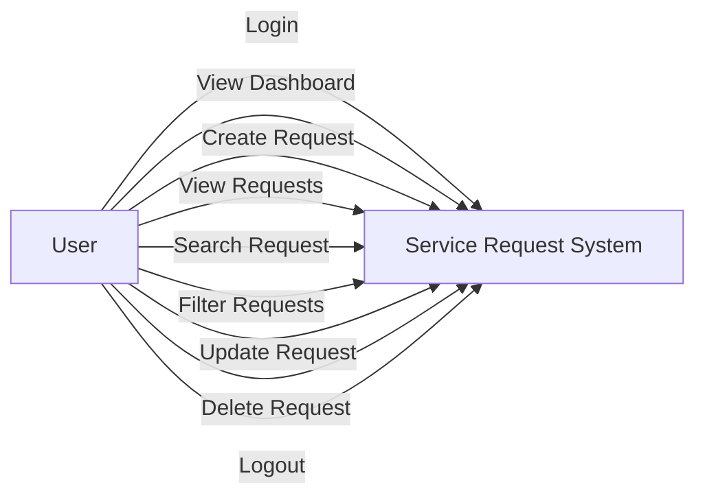
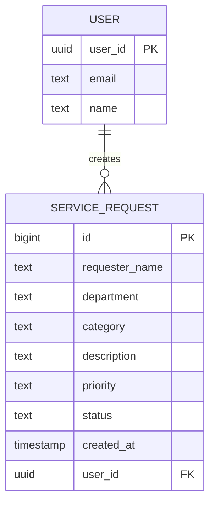

# ICT Service Request Management System

## Student Information

**Name:** [Your Name Here]  
**Section:** [Your Section Here]  
**Course:** Systems Analysis and Design (SAD)  

## GitHub Repository

**Repository URL:** https://github.com/[your-username]/SAD-ServiceRequest-[Lastname]  
**Live System URL:** https://[your-username].github.io/SAD-ServiceRequest-[Lastname]/  

## Problem Statement

The university's ICT office receives technical concerns through verbal requests, text messages, and social media messages. Because requests come from different channels, some concerns are forgotten, duplicated, or not properly monitored. This system provides a centralized online platform where authorized users can record, track, and manage technical support requests, ensuring no request is overlooked and all concerns are properly documented and monitored.

## Use Case Diagram



## ERD (Entity Relationship Diagram)



## Requirements Traceability Matrix

| Req. ID | Requirement | System Feature | Test |
|---------|-------------|----------------|------|
| FR-01 | User can log in | Login Page | TC-01 |
| FR-02 | User can create request | Request Form | TC-02 |
| FR-03 | User can view requests | Request Table | TC-03 |
| FR-04 | User can update request | Edit Function | TC-04 |
| FR-05 | User can delete request | Delete Function | TC-05 |
| FR-06 | User can search | Search Function | TC-06 |
| FR-07 | User can filter | Filter Function | TC-07 |
| FR-08 | System displays summaries | Dashboard | TC-08 |
| BR-01 | Requester name cannot be empty | Input Validation | TC-02 |
| BR-02 | Department must be provided | Input Validation | TC-02 |
| BR-03 | Category must be selected | Input Validation | TC-02 |
| BR-04 | Description must contain sufficient info | Input Validation | TC-02 |
| BR-05 | Priority must be Low, Medium, or High | Input Validation | TC-02 |
| BR-06 | New requests automatically receive Pending status | Default Value | TC-02 |
| BR-07 | Users must log in before managing requests | Authentication | TC-01 |
| BR-08 | Confirmation must appear before deleting | Delete Confirmation | TC-05 |
| BR-09 | Date requested must automatically be recorded | Auto Timestamp | TC-02 |
| BR-10 | Unauthorized database modification prevented | RLS Policies | TC-03 |

## Functional Testing Results

| Test ID | Test Scenario | Expected Result | Status |
|---------|---------------|-----------------|--------|
| TC-01 | Login using valid account | Dashboard appears | PASS |
| TC-02 | Submit valid request | Request saved | PASS |
| TC-03 | Display requests | Existing records appear | PASS |
| TC-04 | Modify request | Changes saved | PASS |
| TC-05 | Delete request | Confirmation appears and record removed | PASS |
| TC-06 | Search requester | Matching records displayed | PASS |
| TC-07 | Filter Pending requests | Only Pending records displayed | PASS |
| TC-08 | Open deployed URL | Application loads online | PASS |

## Screenshots

### Login Page


### Dashboard


### Service Requests Table


### New Request Form


### Analytics Section


## Database Schema

The system uses Supabase PostgreSQL with the following table:

**Table:** `service_requests`

| Column | Data Type | Constraints |
|--------|-----------|-------------|
| id | bigint | PRIMARY KEY, Generated by default as identity |
| requester_name | text | NOT NULL |
| department | text | NOT NULL |
| category | text | NOT NULL |
| description | text | NOT NULL |
| priority | text | NOT NULL, CHECK (priority IN ('Low', 'Medium', 'High')) |
| status | text | NOT NULL DEFAULT 'Pending', CHECK (status IN ('Pending', 'In Progress', 'Completed')) |
| created_at | timestamptz | NOT NULL DEFAULT NOW() |
| user_id | uuid | NOT NULL, REFERENCES auth.users(id) |

## Security

- Row Level Security (RLS) is enabled on the `service_requests` table
- Users can view all requests but can only modify their own records
- Supabase client-safe (publishable) key is used; service_role key is never exposed
- All operations require user authentication

## Deployment

This application is deployed using GitHub Pages.

**Deployment URL:** https://[your-username].github.io/SAD-ServiceRequest-[Lastname]/

## Technologies Used

- **Frontend:** HTML5, CSS3, JavaScript (ES6+)
- **Backend:** Supabase (PostgreSQL + Authentication)
- **Hosting:** GitHub Pages
- **Version Control:** Git / GitHub

## Setup Instructions

1. Clone this repository
2. Update `js/supabase.js` with your Supabase project URL and publishable key
3. Create the `service_requests` table in Supabase using the SQL provided
4. Enable RLS and create the necessary policies
5. Deploy to GitHub Pages via repository settings

## Supabase SQL Setup

```sql
CREATE TABLE IF NOT EXISTS public.service_requests (
    id BIGINT GENERATED BY DEFAULT AS IDENTITY PRIMARY KEY,
    requester_name TEXT NOT NULL,
    department TEXT NOT NULL,
    category TEXT NOT NULL,
    description TEXT NOT NULL,
    priority TEXT NOT NULL CHECK (priority IN ('Low', 'Medium', 'High')),
    status TEXT NOT NULL DEFAULT 'Pending' CHECK (status IN ('Pending', 'In Progress', 'Completed')),
    created_at TIMESTAMPTZ NOT NULL DEFAULT NOW(),
    user_id UUID NOT NULL REFERENCES auth.users(id)
);

ALTER TABLE public.service_requests ENABLE ROW LEVEL SECURITY;

CREATE POLICY "Authenticated users can view requests"
ON public.service_requests FOR SELECT TO authenticated USING (true);

CREATE POLICY "Users can create their own requests"
ON public.service_requests FOR INSERT TO authenticated WITH CHECK (auth.uid() = user_id);

CREATE POLICY "Users can update their own requests"
ON public.service_requests FOR UPDATE TO authenticated USING (auth.uid() = user_id) WITH CHECK (auth.uid() = user_id);

CREATE POLICY "Users can delete their own requests"
ON public.service_requests FOR DELETE TO authenticated USING (auth.uid() = user_id);

CREATE INDEX IF NOT EXISTS idx_service_requests_requester ON public.service_requests(requester_name);
CREATE INDEX IF NOT EXISTS idx_service_requests_status ON public.service_requests(status);
CREATE INDEX IF NOT EXISTS idx_service_requests_priority ON public.service_requests(priority);
CREATE INDEX IF NOT EXISTS idx_service_requests_user_id ON public.service_requests(user_id);
```

## Test Account

**Email:** [test@example.com]  
**Password:** [test-password-123]

> Note: Do not place actual passwords in public repositories. Submit test credentials separately through your LMS if required.
