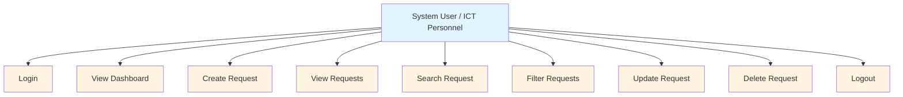

# ICT Service Request Management System

**Student:** [Your Name]  
**Section:** [Your Section]  
**Course:** Systems Analysis and Design (SAD)  
**Laboratory Exercise 3**

---

## Live System
**GitHub Pages URL:** `https://[your-username].github.io/SAD-ServiceRequest-Canching/`

## Repository
**GitHub Repository:** `https://github.com/[your-username]/SAD-ServiceRequest-Canching`

## Test Account
You can create a test account directly from the login page, or use the instructor-provided account.

**Email:** `student@example.com`  
**Password:** `[submit separately via LMS]`

**Note:** Any authenticated Supabase user can view all service requests in the system. Users can only modify or delete requests that they created.

---

## Problem Statement
The university ICT office receives technical concerns through verbal requests, text messages, and social media, causing concerns to be forgotten, duplicated, or improperly monitored. This system provides a centralized online platform for authorized users to record and manage technical support requests efficiently.

## Actors
- **System User / ICT Personnel** - Authorized personnel who submit, view, update, and delete service requests.

## Use Case Diagram



## Entity Relationship Diagram

```mermaid
graph TD
    User[USER<br/>user_id PK<br/>email]
    ServiceRequest[SERVICE_REQUEST<br/>id PK<br/>requester_name<br/>department<br/>category<br/>description<br/>priority<br/>status<br/>created_at<br/>user_id FK]
    
    User -->|1 creates|M| ServiceRequest
    
    style User fill:#e1f5ff
    style ServiceRequest fill:#fff4e1
```

## Requirements Traceability Matrix

| Req. ID | Requirement | System Feature | Test |
|---------|-------------|----------------|------|
| FR-01 | User can log in | Login Page | TC-01 |
| FR-02 | User can create request | Request Form | TC-02 |
| FR-03 | User can view requests | Request Table | TC-03 |
| FR-04 | User can update request | Edit Function | TC-04 |
| FR-05 | User can delete request | Delete Function | TC-05 |
| FR-06 | User can search | Search Function | TC-06 |
| FR-07 | User can filter | Filter Function | TC-07 |
| FR-08 | System displays summaries | Dashboard | TC-08 |

## Functional Testing Results

| Test ID | Test Scenario | Expected Result | Status |
|---------|---------------|-----------------|--------|
| TC-01 | Login using valid account | Dashboard appears | PASS |
| TC-02 | Submit valid request | Request saved | PASS |
| TC-03 | Display requests | Existing records appear | PASS |
| TC-04 | Modify request | Changes saved | PASS |
| TC-05 | Delete request | Confirmation appears and record is removed | PASS |
| TC-06 | Search requester | Matching records displayed | PASS |
| TC-07 | Filter Pending requests | Only Pending records displayed | PASS |
| TC-08 | Open deployed URL | Application loads online | PASS |

## Business Rules Implementation

| Rule | Requirement | Implementation |
|------|-------------|----------------|
| BR-01 | Requester name cannot be empty | HTML5 `required` + JavaScript validation |
| BR-02 | Department must be provided | HTML5 `required` + JavaScript validation |
| BR-03 | Category must be selected | HTML5 `required` + JavaScript validation |
| BR-04 | Description must contain sufficient info | JavaScript validation (min 5 chars) |
| BR-05 | Priority must be Low, Medium, or High | HTML5 `select` with valid options |
| BR-06 | New requests automatically receive Pending status | Default value in database schema |
| BR-07 | Users must log in before managing requests | Auth state check in `app.js` |
| BR-08 | Confirmation before deleting a record | Custom delete confirmation modal |
| BR-09 | Date requested must be automatically recorded | Database `created_at` default `NOW()` |
| BR-10 | Unauthorized database modification prevented | Supabase RLS policies |

---

## Supabase Setup

1. Create a new project at [supabase.com](https://supabase.com)
2. Go to **SQL Editor** and run the following SQL:

```sql
CREATE TABLE service_requests (
    id BIGINT GENERATED BY DEFAULT AS IDENTITY PRIMARY KEY,
    requester_name TEXT NOT NULL,
    department TEXT NOT NULL,
    category TEXT NOT NULL,
    description TEXT NOT NULL,
    priority TEXT NOT NULL,
    status TEXT DEFAULT 'Pending',
    created_at TIMESTAMPTZ DEFAULT NOW(),
    user_id UUID REFERENCES auth.users(id)
);

ALTER TABLE service_requests ENABLE ROW LEVEL SECURITY;

CREATE POLICY "Authenticated users can view requests"
ON service_requests FOR SELECT TO authenticated USING (true);

CREATE POLICY "Authenticated users can insert requests"
ON service_requests FOR INSERT TO authenticated WITH CHECK (auth.uid() = user_id);

CREATE POLICY "Authenticated users can update requests"
ON service_requests FOR UPDATE TO authenticated USING (auth.uid() = user_id);

CREATE POLICY "Authenticated users can delete requests"
ON service_requests FOR DELETE TO authenticated USING (auth.uid() = user_id);
```

3. Enable **Email** authentication in **Authentication > Providers**
4. Copy your **Project URL** and **Publishable Key** into `js/supabase.js`

**Note:** The login page includes a sign-up option. Any authenticated Supabase user can view all service requests. Users can only modify or delete requests that they created.

## GitHub Pages Deployment

1. Push this repository to GitHub
2. Go to **Repository Settings > Pages**
3. Under **Build and deployment**, select:
   - Source: **Deploy from a branch**
   - Branch: **main**
   - Folder: **/(root)**
4. Your site will be available at `https://[username].github.io/SAD-ServiceRequest-Canching/`

## Project Structure

```
SAD-ServiceRequest-Canching/
├── index.html
├── login.html
├── css/
│   └── style.css
├── js/
│   ├── supabase.js
│   ├── auth.js
│   └── app.js
├── README.md
└── documentation/
    └── system-analysis.md
```

## Technologies Used

- **Frontend:** HTML5, CSS3, Vanilla JavaScript
- **Backend:** Supabase (PostgreSQL + Authentication)
- **Deployment:** GitHub Pages
- **Version Control:** Git / GitHub
