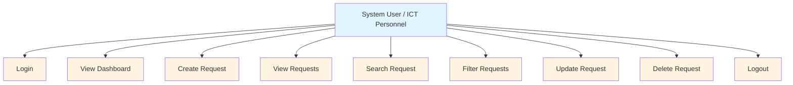

# System Analysis and Design Documentation
## ICT Service Request Management System

---

## 1. Problem Statement

The university ICT office currently receives technical concerns through verbal requests, text messages, and social media. Because requests come from different channels, some concerns are forgotten, duplicated, or not properly monitored. There is a need for a centralized system where authorized users can submit and track technical support requests efficiently.

---

## 2. Actors

| Actor | Description |
|-------|-------------|
| System User / ICT Personnel | Authorized personnel who submit, view, update, search, filter, and delete service requests. Must authenticate before accessing system functions. |

---

## 3. Use Case Diagram



---

## 4. Entity Relationship Diagram

```mermaid
graph TD
    User[USER<br/>user_id PK<br/>email]
    ServiceRequest[SERVICE_REQUEST<br/>id PK<br/>requester_name<br/>department<br/>category<br/>description<br/>priority<br/>status<br/>created_at<br/>user_id FK]
    
    User -->|1 creates|M| ServiceRequest
    
    style User fill:#e1f5ff
    style ServiceRequest fill:#fff4e1
```

**Relationship:** One USER can create many SERVICE_REQUESTs. Each SERVICE_REQUEST belongs to one USER.

---

## 5. Database Design

### Table: `service_requests`

| Column | Data Type | Constraints |
|--------|-----------|-------------|
| id | BIGINT | PRIMARY KEY, GENERATED BY DEFAULT AS IDENTITY |
| requester_name | TEXT | NOT NULL |
| department | TEXT | NOT NULL |
| category | TEXT | NOT NULL |
| description | TEXT | NOT NULL |
| priority | TEXT | NOT NULL |
| status | TEXT | DEFAULT 'Pending' |
| created_at | TIMESTAMPTZ | DEFAULT NOW() |
| user_id | UUID | REFERENCES auth.users(id) |

---

## 6. Business Rules

| Rule ID | Business Rule |
|---------|---------------|
| BR-01 | Requester name cannot be empty. |
| BR-02 | Department must be provided. |
| BR-03 | Category must be selected. |
| BR-04 | Description must contain sufficient information (min 5 characters). |
| BR-05 | Priority must be Low, Medium, or High. |
| BR-06 | New requests automatically receive Pending status. |
| BR-07 | Users must log in before managing requests. |
| BR-08 | A confirmation must appear before deleting a record. |
| BR-09 | Date requested must automatically be recorded. |
| BR-10 | Unauthorized database modification should be prevented. |

---

## 7. System Architecture

The system follows a three-tier architecture:

```
┌─────────────────────────────────────────────────────────────┐
│                        INTERNET                             │
├─────────────────────────────────────────────────────────────┤
│                    GitHub Pages                              │
│  ┌───────────────────────────────────────────────────────┐  │
│  │              HTML / CSS / JavaScript                   │  │
│  └───────────────────────────────────────────────────────┘  │
│                          │                                   │
│                     HTTPS / API                              │
│                          │                                   │
│  ┌───────────────────────────────────────────────────────┐  │
│  │                    SUPABASE                            │  │
│  │  ┌─────────────┐  ┌──────────────────────────────┐    │  │
│  │  │ Auth Service│  │   PostgreSQL Database         │    │  │
│  │  └─────────────┘  │  ┌────────────────────────┐  │    │  │
│  │                   │  │  service_requests table │  │    │  │
│  │                   │  └────────────────────────┘  │    │  │
│  │                   └──────────────────────────────┘    │  │
│  └───────────────────────────────────────────────────────┘  │
└─────────────────────────────────────────────────────────────┘
```

**Frontend:** Static HTML/CSS/JavaScript hosted on GitHub Pages  
**Backend:** Supabase PostgreSQL Database + Authentication  
**Communication:** Supabase JavaScript Client via HTTPS/API

---

## 8. Security Considerations

- The Supabase **publishable (anon) key** is used for client-side operations
- The **service_role key** is never exposed in frontend code
- **Row Level Security (RLS)** is enabled on the `service_requests` table
- RLS policies ensure users can only modify records they created
- All database operations require authentication

---

## 9. Testing Strategy

| Test Type | Description |
|-----------|-------------|
| Functional Testing | Verify each CRUD operation, search, filter, and authentication flow |
| Validation Testing | Ensure business rules (BR-01 through BR-10) are enforced |
| Security Testing | Confirm RLS policies prevent unauthorized access |
| Deployment Testing | Verify the application loads correctly on GitHub Pages |

---

## 10. Traceability Summary

| Requirement ID | Requirement | Implemented Feature | File(s) |
|----------------|-------------|---------------------|---------|
| FR-01 | User can log in | Login form with auth state check | `login.html`, `js/auth.js` |
| FR-02 | User can create request | New Request modal with form validation | `index.html`, `js/app.js` |
| FR-03 | User can view requests | Requests table with all records | `index.html`, `js/app.js` |
| FR-04 | User can update request | Edit modal pre-filled with data | `js/app.js` |
| FR-05 | User can delete request | Delete confirmation modal | `js/app.js` |
| FR-06 | User can search | Search by requester name or description | `js/app.js` |
| FR-07 | User can filter | Filter by status and priority | `js/app.js` |
| FR-08 | System displays summaries | Dashboard with stats cards | `index.html`, `js/app.js` |
